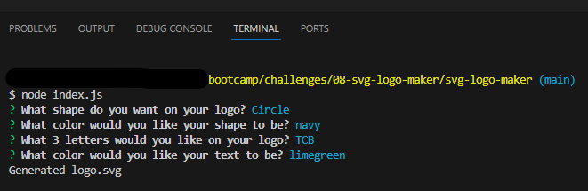

# svg-logo-maker

## Description

This SVG Logo maker is a command-line application that was created with JavaScript, Node and inquirer and will generate an SVG logo file according to the user's specifications.

## Usage

- Run "node index.js" in the terminal 
- Follow the prompts to design your logo.
- The logo.svg will generate in the examples folder.

Here is a video walkthrough. [Check it out!](https://drive.google.com/file/d/1AS2Wnpqg4olt9UyH3yCO7UVOcyrlNaeN/view)

## License
MIT License

## How to Contribute

Please visit [my GitHub](http://www.github.com/shanna-not-shawna) or [email me](mailto:shanna.d.brooks2012@gmail.com) me with any questions, or if you'd like to contribute.